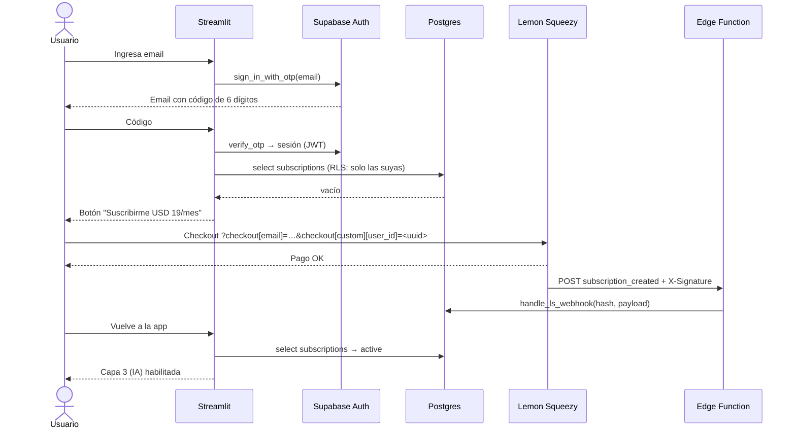
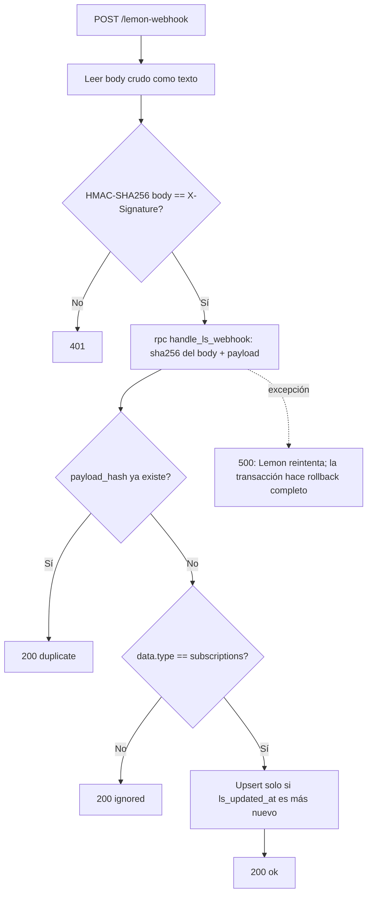

# Arquitectura de pagos v2 — Limpiador PPC

> Estado: propuesta. Pasa de **Bring Your Own Key** a **suscripción mensual de USD 19** con la API Key de OpenAI propia, guardada solo del lado del servidor.

## 1. Objetivo y decisiones clave

| Decisión | Elección | Por qué |
|---|---|---|
| Cobro | Lemon Squeezy (Merchant of Record) | Liquida IVA/impuestos globales y emite facturas; no necesitamos entidad fiscal en cada país. |
| Identidad + datos | Supabase (Auth + Postgres + Edge Functions) | Auth por email sin passwords, RLS nativo y un endpoint serverless para el webhook. |
| Login en Streamlit | OTP de 6 dígitos por email | Funciona sin redirects (Streamlit no maneja bien callbacks OAuth/magic link). |
| Freemium | Capas 1 y 2 (DuckDB + Regex) gratis; Capa 3 (IA) paga | El valor gratis atrae; el costo variable (tokens) queda solo en usuarios que pagan. |
| `past_due` | Mantiene acceso | Lemon Squeezy reintenta el cobro; cortar en el primer fallo genera churn involuntario. |

## 2. Componentes y secretos

```
┌──────────────┐  OTP / JWT   ┌──────────────────┐
│  Streamlit   │─────────────▶│  Supabase Auth   │
│  (app.py)    │  RPC (RLS)   ├──────────────────┤   service_role   ┌────────────────────┐
│              │─────────────▶│  Postgres        │◀─────────────────│ Edge Function      │
│ st.secrets:  │              │  subscriptions   │                  │ lemon-webhook      │
│ OPENAI_KEY   │              │  usage           │                  │ (verifica HMAC)    │
└──────┬───────┘              │  webhook_events  │                  └─────────▲──────────┘
       │ checkout URL         └──────────────────┘                            │ POST + X-Signature
       ▼                                                                      │
┌──────────────────────────────────────────────────────────────────────────────┴──┐
│ Lemon Squeezy: checkout, cobro recurrente, impuestos, customer portal           │
└─────────────────────────────────────────────────────────────────────────────────┘
```

| Secreto | Dónde vive | Nunca en |
|---|---|---|
| `OPENAI_API_KEY` | `st.secrets` (Streamlit Cloud) | Repo, navegador, logs |
| `SUPABASE_URL`, `SUPABASE_ANON_KEY` | `st.secrets` | — (la anon key es pública por diseño; la protege RLS) |
| `SUPABASE_SERVICE_ROLE_KEY` | Solo Edge Function (la inyecta Supabase) | **Streamlit**: saltea RLS |
| `LEMON_SIGNING_SECRET` | Secrets de la Edge Function | Streamlit, repo |

Regla: si falta un secreto, la app hace `raise` al arrancar. Nada de defaults.

## 3. Modelo de datos

```sql
create table public.subscriptions (
  id                  text primary key,             -- data.id de Lemon Squeezy
  user_id             uuid not null references auth.users(id) on delete cascade,
  customer_id         text not null,
  variant_id          text not null,
  status              text not null,                -- on_trial|active|paused|past_due|unpaid|cancelled|expired
  renews_at           timestamptz,
  ends_at             timestamptz,                  -- con status=cancelled: acceso hasta esta fecha
  customer_portal_url text,
  ls_updated_at       timestamptz not null,         -- attributes.updated_at: descarta eventos fuera de orden
  updated_at          timestamptz not null default now()
);
create index subscriptions_user_id_idx on public.subscriptions (user_id);

create table public.webhook_events (
  id           bigint generated always as identity primary key,
  event_name   text not null,
  payload_hash text not null unique,                -- sha256 del body: idempotencia ante reintentos
  received_at  timestamptz not null default now()
);

create table public.usage (
  user_id  uuid not null references auth.users(id) on delete cascade,
  period   date not null,                           -- primer día del mes
  analyses int  not null default 0,
  primary key (user_id, period)
);

alter table public.subscriptions  enable row level security;
alter table public.webhook_events enable row level security;  -- sin policies: solo service_role
alter table public.usage          enable row level security;

create policy "subs: lectura propia"  on public.subscriptions for select using (auth.uid() = user_id);
create policy "usage: lectura propia" on public.usage         for select using (auth.uid() = user_id);
-- Sin policies de escritura: subscriptions solo la escribe el webhook; usage solo consume_quota().
```

### 3.1 Cuota atómica (control de costo de tokens)

El cliente no puede pasar el límite como parámetro: está fijo en la función.

```sql
create or replace function public.consume_quota()
returns boolean language plpgsql security definer set search_path = public as $$
declare
  allowed boolean;
begin
  if not exists (
    select 1 from subscriptions
    where user_id = auth.uid()
      and (status in ('active', 'on_trial', 'past_due')
           or (status = 'cancelled' and ends_at > now()))
  ) then
    return false;
  end if;

  insert into usage (user_id, period, analyses)
  values (auth.uid(), date_trunc('month', now())::date, 1)
  on conflict (user_id, period) do update
    set analyses = usage.analyses + 1
    where usage.analyses < 200                       -- análisis IA por usuario por mes
  returning true into allowed;

  return coalesce(allowed, false);
end $$;

revoke all on function public.consume_quota() from public, anon;
grant execute on function public.consume_quota() to authenticated;
```

## 4. Flujo de alta (checkout)



URL de checkout (MVP):

```
https://<store>.lemonsqueezy.com/buy/<variant_uuid>?checkout[email]=<email>&checkout[custom][user_id]=<uuid>
```

> Riesgo aceptado: el usuario puede editar `user_id` en la URL. Solo le sirve para pagarle la suscripción a otra cuenta. En v2.1 conviene crear el checkout por API (`POST /v1/checkouts`) desde el servidor, con `custom_data` firmado por nosotros.

## 5. Flujo de webhooks

### 5.1 Eventos a suscribir en Lemon Squeezy

| Evento | `data.type` | Acción |
|---|---|---|
| `subscription_created` | `subscriptions` | Insert (vincula `user_id` desde `meta.custom_data`) |
| `subscription_updated` | `subscriptions` | Upsert de estado/fechas |
| `subscription_cancelled` | `subscriptions` | Upsert (`status=cancelled`, acceso hasta `ends_at`) |
| `subscription_resumed` / `subscription_unpaused` | `subscriptions` | Upsert |
| `subscription_expired` / `subscription_paused` | `subscriptions` | Upsert (pierde acceso) |
| `subscription_payment_success` / `_failed` / `_recovered` | `subscription-invoices` | Solo se registran; el cambio de estado llega por `subscription_updated` |

Todos los eventos `subscription_*` traen el objeto suscripción completo. Por eso se procesan con **un único upsert** y no con lógica distinta por evento.

### 5.2 Secuencia dentro de la Edge Function



Puntos críticos:

1. **Firma sobre el body crudo.** Si se parsea el JSON y se vuelve a serializar, el HMAC no coincide.
2. **Comparación en tiempo constante** de la firma.
3. **Idempotencia y upsert en la misma transacción (RPC).** Si el upsert falla, el evento no queda marcado y el reintento lo procesa.
4. **Orden.** Los webhooks pueden llegar desordenados. `ls_updated_at` evita que un evento viejo pise uno nuevo.
5. Deploy con `--no-verify-jwt`: Lemon Squeezy no manda un JWT de Supabase; la autenticación es el HMAC.

### 5.3 Edge Function (`supabase/functions/lemon-webhook/index.ts`)

```ts
import { createClient } from "jsr:@supabase/supabase-js@2";

function requireEnv(name: string): string {
  const value = Deno.env.get(name);
  if (!value) throw new Error(`${name} not configured`);
  return value;
}

const SIGNING_SECRET = requireEnv("LEMON_SIGNING_SECRET");
const supabase = createClient(requireEnv("SUPABASE_URL"), requireEnv("SUPABASE_SERVICE_ROLE_KEY"));
const encoder = new TextEncoder();

const toHex = (buf: ArrayBuffer) =>
  Array.from(new Uint8Array(buf), (b) => b.toString(16).padStart(2, "0")).join("");

async function hmacHex(secret: string, body: string): Promise<string> {
  const key = await crypto.subtle.importKey(
    "raw", encoder.encode(secret), { name: "HMAC", hash: "SHA-256" }, false, ["sign"],
  );
  return toHex(await crypto.subtle.sign("HMAC", key, encoder.encode(body)));
}

function safeEqual(a: string, b: string): boolean {
  if (a.length !== b.length) return false;
  let diff = 0;
  for (let i = 0; i < a.length; i++) diff |= a.charCodeAt(i) ^ b.charCodeAt(i);
  return diff === 0;
}

Deno.serve(async (req) => {
  if (req.method !== "POST") return new Response("Method not allowed", { status: 405 });

  const raw = await req.text();
  const signature = req.headers.get("X-Signature") ?? "";
  if (!safeEqual(await hmacHex(SIGNING_SECRET, raw), signature)) {
    return new Response("Invalid signature", { status: 401 });
  }

  const hash = toHex(await crypto.subtle.digest("SHA-256", encoder.encode(raw)));
  const { data, error } = await supabase.rpc("handle_ls_webhook", { p_hash: hash, p: JSON.parse(raw) });
  if (error) {
    console.error("handle_ls_webhook failed", error.code);  // sin payload: tiene emails
    return new Response("Processing error", { status: 500 });
  }
  return new Response(String(data), { status: 200 });
});
```

### 5.4 RPC transaccional

```sql
create or replace function public.handle_ls_webhook(p_hash text, p jsonb)
returns text language plpgsql security definer set search_path = public as $$
declare
  a       jsonb := p -> 'data' -> 'attributes';
  sub_id  text  := p -> 'data' ->> 'id';
  v_user  uuid;
begin
  insert into webhook_events (event_name, payload_hash)
  values (p -> 'meta' ->> 'event_name', p_hash)
  on conflict (payload_hash) do nothing;
  if not found then
    return 'duplicate';
  end if;

  if p -> 'data' ->> 'type' is distinct from 'subscriptions' then
    return 'ignored';
  end if;

  -- custom_data viene en el alta; en eventos posteriores se reutiliza el user_id guardado.
  v_user := coalesce((p -> 'meta' -> 'custom_data' ->> 'user_id')::uuid,
                     (select user_id from subscriptions where id = sub_id));
  if v_user is null then
    raise exception 'subscription % sin user_id', sub_id;  -- 500 → reintento + alerta
  end if;

  insert into subscriptions as s (id, user_id, customer_id, variant_id, status,
                                  renews_at, ends_at, customer_portal_url, ls_updated_at)
  values (sub_id, v_user, a ->> 'customer_id', a ->> 'variant_id', a ->> 'status',
          (a ->> 'renews_at')::timestamptz, (a ->> 'ends_at')::timestamptz,
          a -> 'urls' ->> 'customer_portal', (a ->> 'updated_at')::timestamptz)
  on conflict (id) do update set
    status = excluded.status, variant_id = excluded.variant_id,
    renews_at = excluded.renews_at, ends_at = excluded.ends_at,
    customer_portal_url = excluded.customer_portal_url,
    ls_updated_at = excluded.ls_updated_at, updated_at = now()
  where s.ls_updated_at < excluded.ls_updated_at;

  return 'ok';
end $$;

revoke all on function public.handle_ls_webhook(text, jsonb) from public, anon, authenticated;
```

## 6. Cambios en `app.py`

1. **Eliminar** el `st.sidebar.text_input` de API Key. La key sale de `st.secrets["OPENAI_API_KEY"]`; si falta, `KeyError` al arrancar.
2. **Login** en la sidebar: email → `sign_in_with_otp` → código → `verify_otp`. Guardar la sesión en `st.session_state`.
3. **Cliente Supabase por sesión**, nunca con `@st.cache_resource`. Un cliente cacheado se comparte entre usuarios y **mezcla sesiones**.

   ```python
   def get_supabase() -> Client:
       client = create_client(st.secrets["SUPABASE_URL"], st.secrets["SUPABASE_ANON_KEY"])
       session = st.session_state.get("sb_session")
       if session:
           client.auth.set_session(session.access_token, session.refresh_token)
       return client
   ```

4. **Gate antes de cada llamada a OpenAI**: `get_supabase().rpc("consume_quota").execute().data`. Si es `False`, mostrar el paywall o el aviso de límite y **no** llamar a la API.
5. **Tope por análisis**: máximo 300 palabras por request, para acotar los tokens.
6. Link **"Gestionar suscripción"** → `customer_portal_url` (cancelar, cambiar tarjeta y ver facturas lo resuelve Lemon Squeezy).

## 7. Seguridad y costos

- **Budget en OpenAI**: crear un proyecto dedicado con límite mensual de gasto. Es la red de seguridad si falla la cuota.
- **Margen**: con `gpt-4o-mini`, 200 análisis/mes de unas 300 palabras deberían costar centavos de dólar frente a USD 19 de ingreso. Validarlo con el dashboard de uso del primer mes real.
- **Prompt injection**: los términos de búsqueda entran al prompt. El impacto es acotado porque la salida se valida contra la lista enviada y solo acepta `Basura` o `Relevante`, como ya hace `_validar_resultados`.
- **Logs**: no loguear payloads de webhook ni el CSV del cliente, porque contienen emails y datos comerciales.
- **Rate limiting**: lo cubre la cuota mensual por usuario. El webhook queda protegido por HMAC y no expone datos.

## 8. Plan de implementación

| # | Paso | Estimación |
|---|---|---|
| 1 | Proyecto Supabase + SQL de las secciones 3 y 5.4 + Auth por OTP | 1 h |
| 2 | Edge Function + `supabase functions deploy lemon-webhook --no-verify-jwt` + secrets | 1–2 h |
| 3 | Lemon Squeezy en **test mode**: producto, variante USD 19/mes, webhook a la URL de la función | 30 min |
| 4 | `app.py`: login, gate, cuota, portal | 3–4 h |
| 5 | E2E en test mode: alta, cancelación, reanudación, pago fallido, webhook duplicado y webhook con firma inválida | 2 h |
| 6 | Pasar a live mode + budget en OpenAI | 30 min |

## 9. A verificar contra la documentación oficial antes de implementar

- [ ] Nombres exactos de eventos y campos del payload (`urls.customer_portal`, `updated_at`, `variant_id`).
- [ ] Que `meta.custom_data` llegue en eventos posteriores al alta. El RPC ya contempla que no llegue.
- [ ] Política de reintentos de webhooks (cantidad y backoff).
- [ ] Sintaxis vigente de `checkout[custom][...]` en URLs de checkout.
- [ ] Firmas de `sign_in_with_otp` / `verify_otp` en la versión de `supabase-py` que se instale.
